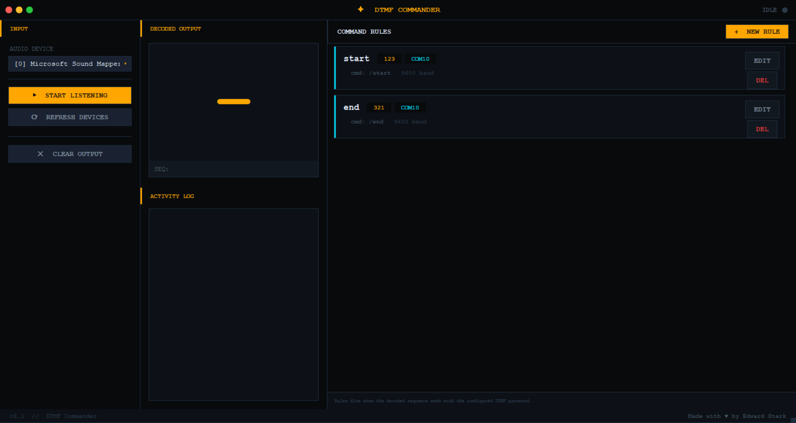

# DTMF Commander

**DTMF Commander** lets you control electronics remotely using a walkie talkie and DTMF tones. Press a button on your radio, and it triggers a serial command on your laptop or Raspberry Pi. No internet, no cellular, just radio.

### How to Set It Up (Step by Step)

**Step 1: Hardware Setup**

Connect a receiver walkie talkie to your computer's audio input using an AUX cable. Set the volume low enough to avoid distortion. Alternatively, use an RTL SDR instead of a second walkie talkie.

**Step 2: Install Dependencies**

```bash
pip install pyaudio numpy scipy
```

**Step 3: Run the App**

```bash
python dtmf_ui.py
```

**Step 4: Configure the App**

Select your audio input device from the dropdown menu. Enter a password (for example, 1234). Choose the COM port your Arduino or relay board is connected to. Type the serial command you want to send (for example, "RELAY_ON").

**Step 5: Test It**

Hold PTT on your transmitter walkie talkie and press the number keys. The app will display each detected tone on the screen. When you enter the correct password, it sends your serial command.

### What You Need

- One walkie talkie with a keypad (transmitter)
- One walkie talkie without a keypad (receiver) OR an RTL SDR dongle
- An AUX cable
- A laptop or Raspberry Pi
- (Optional) An MT8870 decoder module and relay board for controlling real hardware

### Example Uses

- Farmers turning water pumps on and off from a truck
- Hobbyists controlling lights or motors from across a field
- Amateur radio operators testing remote base controls
- Makers building low cost telemetry systems

### Common Issues

- **No tones detected:** Check that the receiver volume is not too loud or too quiet. Adjust and try again.
- **False detections:** Lower the volume or move the receiver away from noisy electronics.
- **Wrong COM port:** Check your device manager to confirm the correct port number.

### Links (for SDR users)

- Download SDR sharp or SDR plus plus
- Download Virtual Audio Cable 

### License

Open source. Use responsibly. I am not responsible for misuse.
